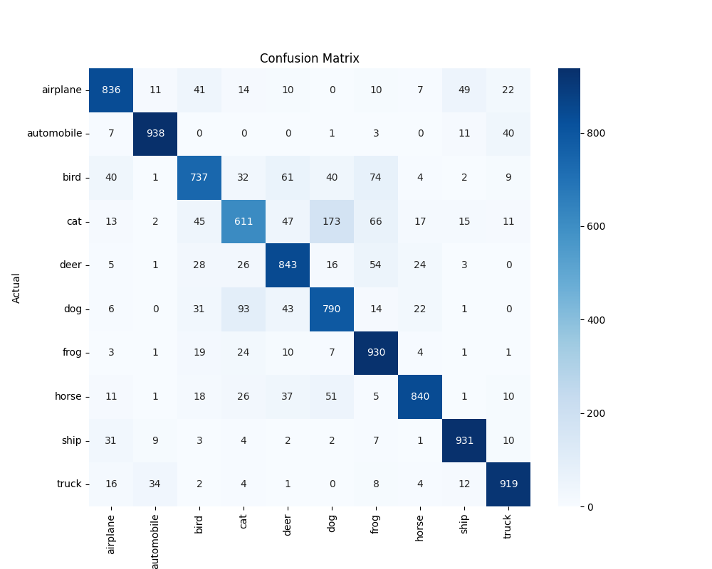

# CNN-Based Image Classification (PyTorch)

This project implements a Convolutional Neural Network (CNN) using PyTorch to perform multi-class image classification on the CIFAR-10 dataset. The model is trained with data augmentation, batch normalization, and dropout to improve generalization and reduce overfitting.

## Dataset
CIFAR-10 contains 60,000 color images (32×32) across 10 classes:

airplane, automobile, bird, cat, deer, dog, frog, horse, ship, truck

- 50,000 training images
- 10,000 test images

## Model Architecture
The CNN architecture consists of multiple convolutional blocks followed by a fully connected classifier:

Conv2D → BatchNorm → ReLU  
Conv2D → BatchNorm → ReLU  
MaxPool → Dropout  

Conv2D → BatchNorm → ReLU  
Conv2D → BatchNorm → ReLU  
MaxPool → Dropout  

Conv2D → BatchNorm → ReLU  
Conv2D → BatchNorm → ReLU  
MaxPool → Dropout  

Flatten → Fully Connected Layer → Dropout → Output Layer (10 classes)

## Training Configuration
- Optimizer: Adam
- Learning Rate: 0.001
- Weight Decay: 1e-4
- Batch Size: 64
- Epochs: 30
- Learning Rate Scheduler: StepLR

## Data Augmentation
To improve generalization, the following augmentations are applied:

- Random Horizontal Flip
- Random Crop
- Random Rotation
- Normalization

## Results

Best Validation Accuracy: **86.3%**  
Test Accuracy: **83.7%**

## Model Evaluation

Model performance was analyzed using a confusion matrix and class-wise error analysis.



The model performs well on visually distinct classes such as automobiles, ships, and trucks, while confusion occurs among visually similar animal categories like cats and dogs.

## Project Structure
```
cnn-cifar10-pytorch
│
├── train.py
├── evaluate.py
├── confusion_matrix.png
├── README.md
└── .gitignore
```

## Installation
Install dependencies:
pip install torch torchvision matplotlib seaborn scikit-learn

## Train the model
python train.py

## Evaluate the model
python evaluate.py


## Key Learnings

This project demonstrates:

- Building CNN architectures in PyTorch
- Applying data augmentation to improve model robustness
- Using batch normalization and dropout to reduce overfitting
- Evaluating model performance with confusion matrices and class-wise metrics


